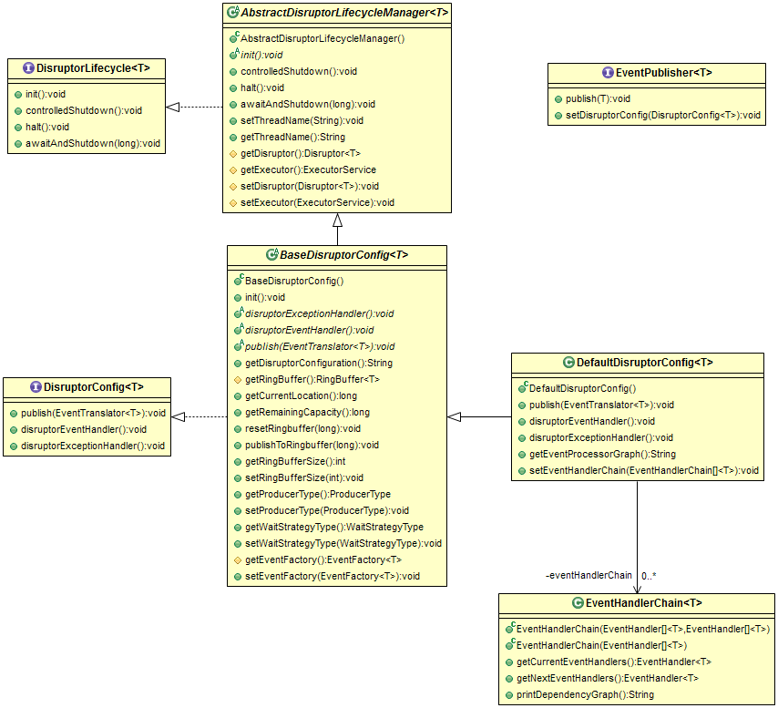

Spring managed LMAX Disruptor
==================
This project wraps the amazing LMAX Disruptor and ring buffer components to be used by a Spring managed context.
You can create as many disruptor spring beans and all of them will be automatically registered as a JMX MBean.

About LMAX Disruptor
-----
A single threaded High concurrency, low-latency solution by LMAX.

Read more about this in:       
- [LMAX Disruptor Homepage](http://lmax-exchange.github.io/disruptor/)    
- [LMAX Disruptor Architecture by Martin Fowler](http://martinfowler.com/articles/lmax.html)      

Software Prerequisites
----------------------
1. JDK 8+
2. Maven 3+
3. Git

Versions used
-----
- Spring: 4.3.x    
- LMAX Disruptor: 3.3.6       

Example project
----
Checkout [disruptor-billing](https://github.com/anair-it/disruptor-billing-example) with usage examples.    

How-to
----
1. Create Event Publisher(s) by implementing org.anair.disruptor.pubilsher.EventPublisher      
2. Create Event Processors by implementing com.lmax.disruptor.EventHandler       
3. Create Event Factory to represent the model object stored in the ring buffer              
4. Create Event Translator to publish data to the ring buffer   
5. Create a spring bean to configure and create a disruptor.

Required values:    
- Executor Thread name: Give a name to the thread the disruptor will be working on. This will help in debugging disruptor logs by looking for the thread name.    
- EventFactory: Factory wrapper around the model object. This is used to prepare the ring buffer with the model type objects.      
- EventHandlerChain: Design the dependency barrier and event processor/consumer dependencies in a chained manner.        
 
Default values, if not provided through Spring configuration:         
- Ring buffer size: 1024       
- Producer Type: Single producer          
- Wait Strategy Type: Blocking Wait Strategy       

The spring configuration is based on the Consumer Dependency diamond graph that looks like this:

	                                       |     journalBillingEventProcessor     |     billingBusinessEventProcessor                 |
	                                       |    /                                 |    /                                              |
	                                       |   /                                  |   /                                               |
	billingEventPublisher -> Ring Buffer ->|  -                                   |  -  corporateBillingBusinessEventProcessor        | -billingOutboundFormattingEventProcessor
	                                       |   \                                  |   \                                               |
	                                       |    \                                 |    \                                              |
	                                       |     billingValidationEventProcessor  |     customerSpecificBillingBusinessEventProcessor |

Spring configuration:    

	<bean id="billingDisruptor" class="org.anair.disruptor.DefaultDisruptorConfig"
		init-method="init" destroy-method="controlledShutdown">

		<property name="threadName" value="billingThread" />
		<property name="eventFactory">
			<bean
				class="org.anair.billing.disruptor.eventfactory.BillingEvent" />
		</property>
		<property name="eventHandlerChain">
			<array>
				<bean class="org.anair.disruptor.EventHandlerChain" scope="prototype">
					<constructor-arg name="currentEventHandlers">
						<array value-type="com.lmax.disruptor.EventHandler">
							<ref bean="journalBillingEventProcessor" />
							<ref bean="billingValidationEventProcessor" />
						</array>
					</constructor-arg>
					<constructor-arg name="nextEventHandlers">
						<array value-type="com.lmax.disruptor.EventHandler">
							<ref bean="billingBusinessEventProcessor" />
							<ref bean="corporateBillingBusinessEventProcessor" />
							<ref bean="customerSpecificBillingBusinessEventProcessor" />
						</array>
					</constructor-arg>
				</bean>
				
				<bean class="org.anair.disruptor.EventHandlerChain" scope="prototype">
					<constructor-arg name="currentEventHandlers">
						<array value-type="com.lmax.disruptor.EventHandler">
							<ref bean="billingBusinessEventProcessor" />
							<ref bean="corporateBillingBusinessEventProcessor" />
							<ref bean="customerSpecificBillingBusinessEventProcessor" />
						</array>
					</constructor-arg>
					<constructor-arg name="nextEventHandlers">
						<array value-type="com.lmax.disruptor.EventHandler">
							<ref bean="billingOutboundFormattingEventProcessor" />
						</array>
					</constructor-arg>
				</bean>
			</array>
		</property>
	</bean>

Logging
----
Add to log4j.properties of your application to monitor disruptor activities    
	
	org.anair.disruptor=INFO 
    
JMX
---
1.Create/configure your local JMX MBean server     
2.Add the below spring configuration and pass in the mbeanServer bean:
	
	<bean class="org.anair.disruptor.jmx.JmxDisruptorManager" 
		p:mBeanServer-ref="mbeanServer"/> 
3.On application context startup, all Disruptor beans will be automatically identified and registered as MBeans         
4.View Disruptor MBeans through JConsole/Visual VM     

Design Diagrams
----
###Disruptor Class diagram
